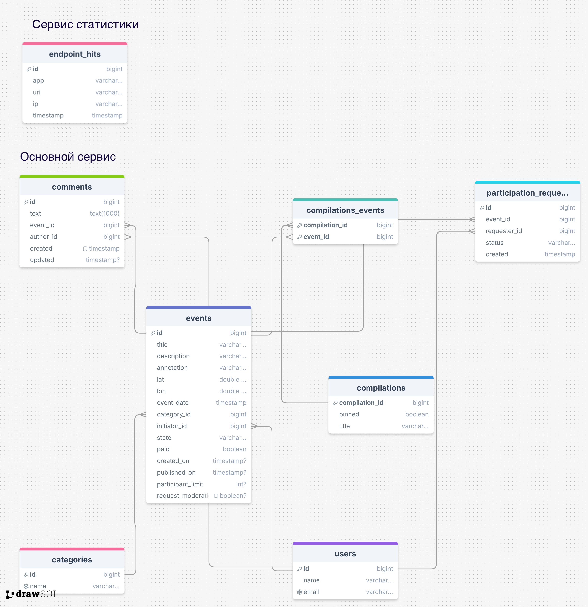

# java-explore-with-me
Дипломная работа по курсу Яндекс Практикум: Java Developer
В рамках дипломного проекта разработано приложение ExploreWithMe (англ. «Исследуй со мной»). Приложение является афишей, в которой можно предложить какое-либо событие от выставки до похода в кино и собрать компанию для участия в нём.

## Архитектура проекта
Приложение состоит из 2 модулей: 
- stat - модуль статистики 
- main-service - основной модуль. 

Задача модуля статистики - учитывать 
запросы к определенным URL и выдавать информацию о посещениях. В основном модуле реализован следующий функционал:
работа с пользователями, событиями, запросами на участия в событиях и комментариями. Существует 3 уровня доступа: публичный, приватный, админский.

## Стек технологий
Java 21, Spring Boot, Lombok, Hibernate, PostgreSQL, H2Database, REST API, Maven, JUnit, Swagger UI, MapStruct

## Спецификации API:
- спецификация основного сервиса:[ewm-main-service-spec.json](ewm-main-service-spec.json)
- спецификация сервиса статистики:[ewm-stats-service-spec.json](ewm-stats-service-spec.json)

## Требования к публичному API
Публичный API должен предоставлять возможности поиска и фильтрации событий. 
- сортировка списка событий должна быть организована либо по количеству просмотров, которое будет запрашиваться в сервисе статистики, либо по датам событий;
- при просмотре списка событий должна возвращаться только краткая информация о мероприятиях;
- просмотр подробной информации о конкретном событии нужно настроить отдельно (через отдельный эндпоинт);
- каждое событие должно относиться к какой-то из закреплённых в приложении категорий;
- должна быть настроена возможность получения всех имеющихся категорий и подборок событий (такие подборки будут составлять администраторы ресурса);
- каждый публичный запрос для получения списка событий или полной информации о мероприятии должен фиксироваться сервисом статистики.

## Требования к API для авторизованных пользователей
Закрытая часть API должна реализовать возможности зарегистрированных пользователей продукта. Вот что нужно учесть:
- авторизованные пользователи должны иметь возможность добавлять в приложение новые мероприятия, редактировать их и просматривать после добавления;
- должна быть настроена подача заявок на участие в интересующих мероприятиях;
- создатель мероприятия должен иметь возможность подтверждать заявки, которые отправили другие пользователи сервиса.

## Требования к API для администратора
Административная часть API должна предоставлять возможности настройки и поддержки работы сервиса. Обратите внимание на эти пункты:
- нужно настроить добавление, изменение и удаление категорий для событий;
- должна появиться возможность добавлять, удалять и закреплять на главной странице подборки мероприятий;
- требуется наладить модерацию событий, размещённых пользователями, — публикация или отклонение;
- также должно быть настроено управление пользователями — добавление, активация, просмотр и удаление.

## Модель данных
Жизненный цикл события должен включать несколько этапов.
- Создание.
- Ожидание публикации. В статус ожидания публикации событие переходит сразу после создания.
- Публикация. В это состояние событие переводит администратор.
- Отмена публикации. В это состояние событие переходит в двух случаях. Первый — если администратор решил, что его нельзя публиковать. Второй — когда инициатор события решил отменить его на этапе ожидания публикации.

## Диаграмма базы данных

## Дамп БД
- Сервис статистики: [schema.sql](stat/stat-service/src/main/resources/schema.sql)
- Основной сервис: [schema.sql](main-service/src/main/resources/schema.sql)

## Фичи

Помимо основной части, реализована дополнительная функциональность: Комментарии (Возможность оставлять комментарии к событиям и модерировать их).

Остальные фичи, из предложенных, планирую реализовать позднее, для практики:

Подписки:
- Первый вариант. Возможность подписываться на других пользователей и получать список актуальных событий, опубликованных этими пользователями.
- Второй вариант. Подписка на друзей и возможность получать список актуальных событий, в которых они принимают участие.

Рейтинги:
- Возможность ставить лайк/дизлайк событию. Формирование рейтинга мероприятий и рейтинга их авторов. Возможность сортировки событий в зависимости от рейтингов.

Администрирование
- Первый вариант. Возможность для администратора добавлять конкретные локации — города, театры, концертные залы и другие в виде координат (широта, долгота, радиус). Получение списка этих локаций. Возможность поиска событий в конкретной локации.
- Второй вариант. Улучшение модерации событий администратором — возможность выгружать все события, ожидающие модерации, делать их проверку, а также оставлять комментарий для инициатора события, если оно не прошло модерацию. При этом у инициатора есть возможность исправить замечания и отправить событие на повторную модерацию.

## 